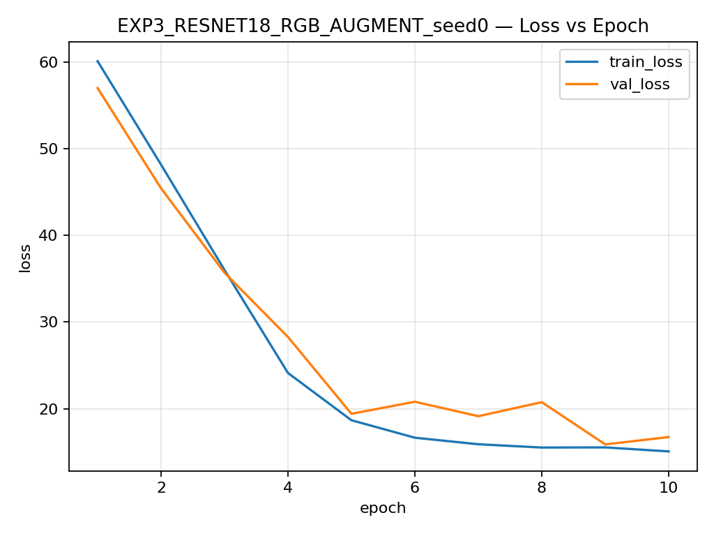
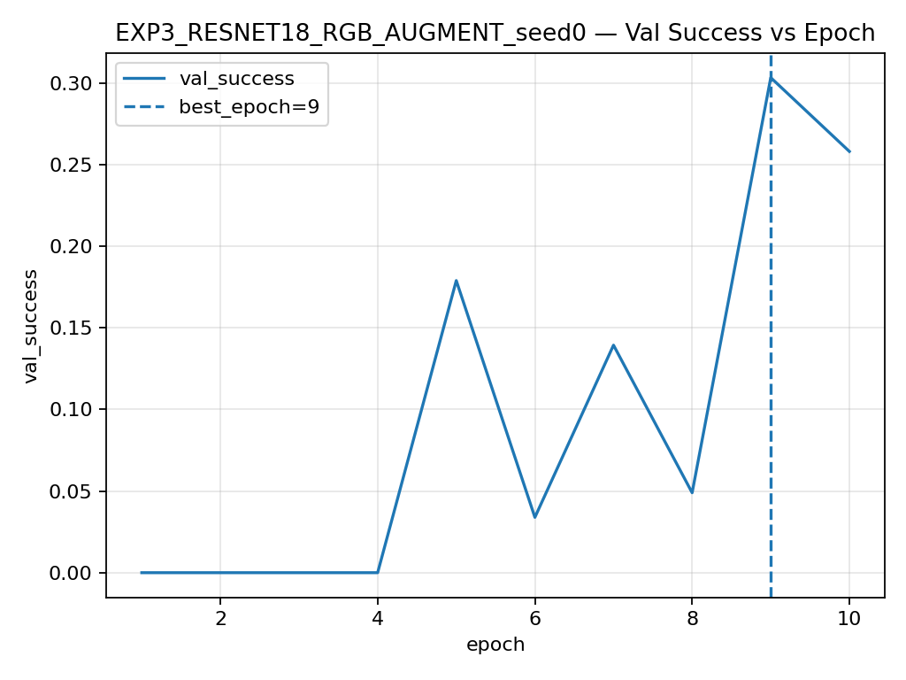

# Resumen de resultados (versión PRO)

## Ganador por media de val_success (media ± std por seed)
**EXP3_RESNET18_RGB_AUGMENT**

### Figuras ganadoras (seed0)
- Loss (train/val): 
- val_success: 

## Tabla por experimento base (media ± std por seed)
| Experimento base | n(seeds) | val_success | val_iou | val_angle | val_loss |
|---|---:|---:|---:|---:|---:|
| EXP1_SIMPLE_RGB | 3 | 0.1620 ± 0.0198 | 0.2726 ± 0.0241 | 73.52 ± 1.95 | 19.6899 ± 0.2735 |
| EXP2_SIMPLE_RGBD | 3 | 0.1651 ± 0.0210 | 0.2707 ± 0.0112 | 74.53 ± 0.90 | 20.0934 ± 0.2586 |
| EXP3_RESNET18_RGBD | 3 | 0.2536 ± 0.0093 | 0.2820 ± 0.0120 | 65.38 ± 3.26 | 17.6464 ± 0.5550 |
| EXP3_RESNET18_RGB_AUGMENT | 3 | 0.2655 ± 0.0335 | 0.2937 ± 0.0239 | 62.64 ± 5.74 | 16.9128 ± 0.9828 |
